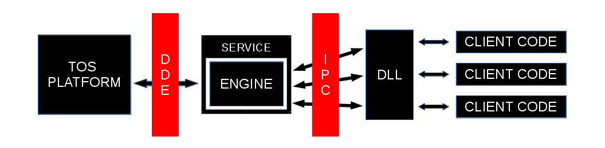
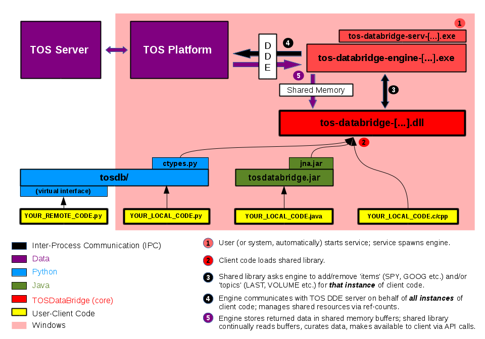

## TOSDataBridge  
- - -
TOSDataBridge (TOSDB) is an open-source collection of resources for pulling real-time streaming data off of TDAmeritrade's ThinkOrSwim(TOS) platform, providing C, C++, Java and Python interfaces. 

TOSDB uses TOS's antiquated, yet still useful, DDE feature, directly through the Windows API. The C / C++ interfaces are implemented as a shared library that communicates with a backend Windows Service. 



The Python and Java interfaces wrap this library in a more object-oriented, user-friendly format.

The core implementation is not portable, but the python interface does provides a thin virtualization layer over TCP. A user running Windows in a Virtual Machine, for instance, can expose the same python interface to a different host system running python3. 



<br>

### Updates
- - -
 
#### Accessing the TDAmeritrade API Directly 

Ameritrade recently expanded and opened up their API for streaming/historical data, account access,
and trade execution. [Take a look at a new front-end library for it that's currently in development.](https://github.com/jeog/TDAmeritradeAPI) If you're simply looking for light-weight access to real-time market data and/or custom TOS studies/strategies data TOSDataBridge is probably a better approach.

#### New Symbols for Futures Contracts

Ameritrade recently changed the symbols needed for futures contracts. For example, "/ES" is now "/ES:XCME". 

/ES:XCME   
/NQ:XCME   
/YM:XCBT   
/RTY:XCME   
/NKD:XCME   
/EMD:XCME   
/VX:XCBF   
/BTC:XCME   
/XBT:XCBF   
/CL:XNYM   
/QM:XNYM   
/NG:XNYM   
/QG:XNYM   
/RB:XNYM   
/HO:XNYM   
/BZ:XNYM   
/GC:XCEC   
/MGC:XCEC   
/SI:XCEC   
/SIL:XCEC   
/HG:XCEC   
/PL:XNYM   
/PA:XNYM   
/ZB:XCBT   
/ZN:XCBT   
/ZF:XCBT   
/ZT:XCBT   
/UB:XCBT   
/TN:XCBT   
/GE:XCME   
/ZQ:XCBT   
/GLB:XCME   
/6A:XCME   
/M6A:XCME   
/6B:XCME   
/M6B:XCME   
/6C:XCME   
/6E:XCME   
/E7:XCME   
/M6E:XCME   
/6J:XCME   
/J7:XCME   
/6M:XCME   
/6N:XCME   
/6S:XCME   
/ZC:XCBT   
/XC:XCBT   
/ZS:XCBT   
/XK:XCBT   
/ZW:XCBT   
/XW:XCBT   
/KE:XCBT   
/ZM:XCBT   
/ZL:XCBT   
/ZO:XCBT   
/HE:XCME   
/GF:XCME   
/LE:XCME   
/LBS:XCME   
/FNG:IFUS   
/MME:IFUS   
/DX:IFUS   
/YG:IFUS   
/YI:IFUS   
/CT:IFUS   
/CC:IFUS   
/KC:IFUS   
/SB:IFUS   
/OJ:IFUS   


### Requirements
- - -
- Windows for the core implementation. (The python interface is available to any system running python3.)
- TDAmeritrade's ThinkOrSwim(TOS) platform that exposes DDE functionality (the Window's verion)
- VC++ 2012 Redistributable (included)

### Versions
- - -

- **v0.8** \[branch 'v0.8'\] - 'stable' version that guarantees up-to-date binaries, signatures, and symbols (use the README from branch 'v0.8')

- **v0.9** \[branch 'master'\] - development version that may lack up-to-date binaries, signatures, and/or symbols

### New Features
- - -
- ***'CUSTOM' Topics*** - [access the 19 CUSTOM fields exported by TOS](README_DETAILS.md#custom-topics).
    - export calculations, studies, strategy triggers etc.  
    - use ThinkScript or the Condition Wizard from within TOS to build custom quotes.  
- ***'GetNFromMarker'*** - calls added to C API allowing for stateless blocking calls to be built on top.  
- ***'StreamingSession'*** - python Context Manager that provides blocking streaming data for any combination of items/topics  
    
### Quick Setup
- - -
- tosdb-setup.bat will attempt to install the necessary modules/dependencies for you but you should refer to [Installation Details](README_INSTALL.md) for a more detailed explanation
- Be sure to know what build you need(x86 vs x64); it should match your system, all the modules you'll need, and your version of Python(if you plan on using the python wrapper), or your version of the Java Runtime(if you plan on using the java wrapper)

    ##### Core C/C++ Libraries
    ```
    (Admin) C:\[...TOSDataBridge]\tosdb-setup.bat   [x86|x64]   [admin]   [session]
    ```

    - [x86|x64] : the version to build (required)
    - [admin] : does your TOS platform require elevation? (optional) 
    - [session] : override the service's attempt to determine the session id when exiting from session-0 isolation. The tos-databridge-engine.exe[] binary needs to run in the same session as the ThinkOrSwim platform. **Most users shouldn't worry about this** unless they plan to run in a non-standard environment (e.g an EC2 instance).  [An explanation of Sessions, Desktops, and Stations.](https://blogs.technet.microsoft.com/askperf/2007/07/24/sessions-desktops-and-windows-stations/) (optional)
 
    ```
    Example 1: C:\TOSDataBridge\> tosdb-setup.bat x86
    Example 2: C:\TOSDataBridge\> tosdb-setup.bat x64 admin
    Example 3: C:\TOSDataBridge\> tosdb-setup.bat x64 admin 2
    ```

    ##### Python Wrapper (optional)
    ```
    C:\[...TOSDataBridge]\python\python setup.py install
    ```
    - Core C/C++ libs (above) must be installed first to use the (non-virtual) interface
    - tosdb/_tosdb.py is generated automatically by setup.py

    ##### Java Wrapper (optional)    
    - Core C/C++ libs (above) must be installed first
    - *java/tosdatabridge.jar* should be included (source is in java/src if you want/need to build)
    

### Quick Start
- - -
1. You may need to white-list some of these files (specifically tos-databridge-engine-\[x86|x64].exe) in your Anti-Virus software before proceeding.
2. Start the service:

    ```
    (Admin) C:\> SC start TOSDataBridge
    ```
   (consider having the service begin automatically on startup to avoid this step in the future; see #9 in the [Installation Details](README_INSTALL.md).)
3. Log on to your TOS platform

##### For C/C++:
- Include tos_databridge.h header in your code 
- Use the library calls detailed in [C/C++ API](README_API.md)
- Link with *tos-databridge-[version]-[build].dll*
- Build
- Run

##### For Python:
- import tosdb
- [docs](README_PYTHON.md) 
- [tutorial](python/tutorial.md)

##### For Java:
- add *java/tosdatabridge.jar* to your classpath
- [see docs](README_JAVA.md) for an intro to the API, or the source(java/src) for the details
- Compile
- Run

### Build (optional)
- - -
- The recommended way to build from source is to use VisualStudio. Open the .sln file in /VisualStudioBuild, go to the appropriate build, and select 'build'. 

- Object code and logs are placed into an intermediate sub-directory of /VisualStudioBuild of form /$(Configuration)/$(Platform). After the object code is linked the binaries are sent to a sub-directory of /bin of form /$(Configuration)/$(Platform) and the symbol files (if applicable) are sent to /symbols/$(Configuration).

- There are 32 and 64 bit (Win32 and x64) binaries included along with the relevant configurations in the VisualStudio solution. Debug versions have a "_d" suffix to avoid collisions. It's up to the user to choose and use the correct builds for ALL modules. The python library will search for the underlying DLL (-x64 vs. -x86) that matches the build of that version of python. The java wrapper requires a build type that matches the Java Runtime(JRE) version.


### Contents
- - -
- **/include** - C/C++ header files; your C/C++ code must include the tos-databridge.h header; C++ code needs to be sure the compiler can find containers.hpp, generic.hpp, exceptions.hpp.

- **/src** - C/C++ source files; if building from source simply open the .sln file inside /VisualStudioBuild, select the configuration/platform, and build.

- **/VisualStudioBuild** - The complete Visual Studio solution with properties, pre-processor options, relative links etc. set, ready to be built.

- **/bin** - Compiled (release only) binaries by build type. **(master branch may, or may not, contain all, or any)**

    - *tos-databridge-serv-[x86|x64].exe* : The service process that spawns and controls the main engine described below. This program is run as a typical windows service with SYSTEM privileges; as such its intended role is very limited. 
    
    - *tos-databridge-engine-[x86|x64].exe* : The main engine - spawned from tos-databridge-serv.exe - that interacts with the TOS platform and our DLL(below). It runs with a lower(ed) integrity level and reduced privileges. 
    
    - *tos-databridge-[version]-[x86|x64].dll* : The library/interface that client code uses to access TOSDB. Review tos-databridge.h, and the sections below, for all the necessary calls, types, and objects.
    
    - *_tos-databridge-[x86|x64].dll* : A back-end library that provides custom concurrency and IPC objects; logging and utilities; as well as the Topic-String mapping. 
    
    - *tos-databridge-shell-[x86|x64]* : A shell used to interact directly with the library calls.

- **/Symbols** - Symbol (.pdb) files **(master branch may, or may not, contain all, or any)**

- **/python** - Files relevant to the python wrapper.

    - **tosdb/** : A python package that serves as a wrapper around *tos-databridge-[version]-[x86|x64].dll*. It provides a more object oriented, simplified means of accessing the core functionality.  
    
    - **tosdb/intervalize/** : Sub-package that provides fixed intervals(e.g OHLC).

    - **tosdb/streaming/** : Sub-package that provides blocking/synchronous mechanisms for accessing streaming data.
    
    - **tosdb/cli_scripts/** : Sub-package for 'client' scripts built on top of the python wrapper.

- **/java** - Files relevant to the Java wrapper.

- **/test** - Test scripts for the various languages and modules.

- **/sigs** - The detached signature for each binary; sha256 checksums for binaries and signatures; **(master branch may, or may not, contain all, or any)**

- **/res** - Miscellaneous resources

- **/log** - All log files and dumps

### Docs
- - - 

#### [Installation](README_INSTALL.md)


#### [Details](README_DETAILS.md)


#### [C/C++ API](README_API.md)


#### [Python](README_PYTHON.md)


#### [Java](README_JAVA.md)


#### [Troubleshooting](README_TROUBLESHOOTING.md)


#### [FAQ](README_FAQ.md)


### Contributions
- - -
This project grew out of personal need and is maintained by a single developer. Contributions - testing, bug fixes, suggestions, extensions, whatever - are always welcome. If you want to contribute something non-trivial it's recommended you communicate the intention first to avoid unnecessary and/or conflicting work.

Simply reporting bugs or questioning unintuitive interface design can be very helpful.


### License & Terms
- - -
*TOSDB is released under the GNU General Public License(GPL); a copy (LICENSE.txt) should be included. If not, see http://www.gnu.org/licenses. The author reserves the right to issue current and/or future versions of TOSDB under other licensing agreements. Any party that wishes to use TOSDB, in whole or in part, in any way not explicitly stipulated by the GPL, is thereby required to obtain a separate license from the author. The author reserves all other rights.*

*This program is distributed in the hope that it will be useful, but WITHOUT ANY WARRANTY; without even the implied warranty of MERCHANTABILITY or FITNESS FOR A PARTICULAR PURPOSE. See the GNU General Public License for more details.*

*By choosing to use the software - under the broadest interpretation of the term "use" \- you absolve the author of ANY and ALL responsibility, for ANY and ALL damages incurred; including, but not limited to, damages arising from the accuracy and/or timeliness of data the software does, or does not, provide.*

*Furthermore, TOSDB is in no way related to TDAmeritrade or affiliated parties; users of TOSDB must abide by their terms of service and are solely responsible for any violations therein.*

- - -

*Copyright (C) 2014 Jonathon Ogden*


