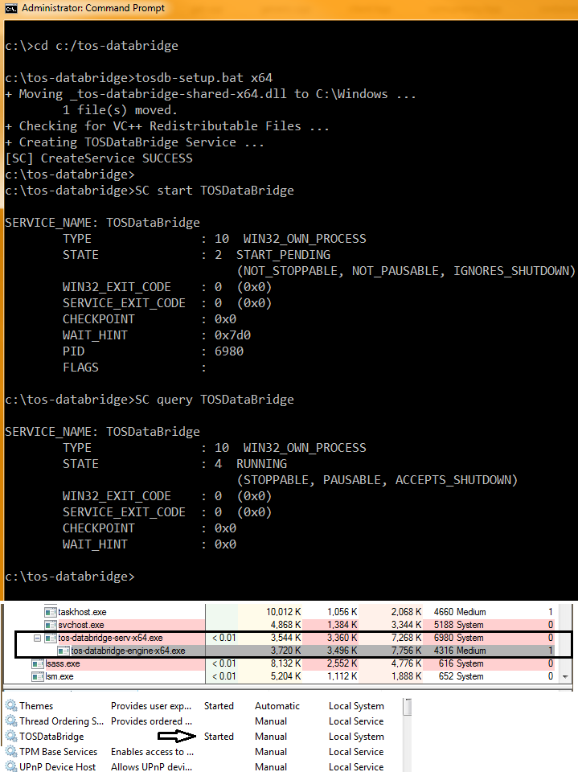

## TOSDataBridge v0.4 
- - -
TOSDataBridge (TOSDB) is an open-source collection of resources for 'scraping' real-time streaming data off of TDAmeritrade's ThinkOrSwim(TOS) platform, providing C, C++, and Python interfaces. Users of the TOS platform - with some basic programming/scripting knowledge - can use these tools to populate their own databases with market data; analyze large data-sets in real-time; test and debug other financial apps; or even build extensions on top of it.

TOSDB uses TOS's antiquated, yet still useful, DDE feature, directly through the Windows API. The C / C++ interfaces are implemented as a shared library(DLL) that communicates with a back-end Windows Service. The Python interface wraps this library in a more object-oriented, user-friendly format, providing an interactive environment for easy access to the low(er)-level calls.

Obviously the core implementation is not portable, but the python interface does provides a thin virtualization layer over TCP. A user running Windows in a Virtual Machine, for instance, can expose the exact same python interface to a different host system running python3. 

### Requirements
- - -
- Windows for the core implementation(tested on Windows 7 SP1, Vista SP2,and Server 2008 R2.) The python interface is available to any system running python3(also tested on Debian/Linux-3.2.)
- TDAmeritrade's ThinkOrSwim(TOS) platform that exposes DDE functionality (the Window's verion)
- VC++ 2012 Redistributable (included)
- Some basic Windows knowledge; some basic C, C++, or Python(3) programming knowledge

### Versions
- - -
Major changes will generally lead to a new version/branch, but not necessarily the label of 'stable'. Minor changes may or may not use a seperate branch that will be merged back into master when deemed 'usable'.  

- **v0.3** (branch 'v0.3') - 'stable' version that guarantees up-to-date binaries/signatures (use the README from branch 'v0.3') 

- **v0.4** (branch 'master') - pre-release development version that may not have up-to-date binaries/signatures
    
### Quick Setup
- - -
- tosdb-setup.bat will attempt to install the necessary modules/dependencies for you but you should refer to **[Installation Details](#installation-details)** below for a more detailed explanation
- Be sure to know what build you need(x86 vs x64); it should match your system, all the modules you'll need, and your version of Python(if you plan on using the python wrapper)

    ##### Core C/C++ Libraries
    ```
    (Admin) C:\[...TOSDataBridge]\tosdb-setup.bat   [x86|x64]   [admin]   [session]
    ```

    - [x86|x64] : the version to build (required)
    - [admin] : does your TOS platform require elevation? (optional) 
    - [session] : override the service's attempt to determine the session id when exiting from session-0 isolation. The tos-databridge-engine.exe[] binary needs to run in the same session as the ThinkOrSwim platform. **Most users shouldn't worry about this** unless they plan to run in a non-standard environment (e.g an EC2 instance).  [An explanation of Sessions, Desktops, and Stations.](https://blogs.technet.microsoft.com/askperf/2007/07/24/sessions-desktops-and-windows-stations/) (optional)
 
    ```
    Example 1: C:\TOSDataBridge\> tosdb-setup.bat x86
    Example 2: C:\TOSDataBridge\> tosdb-setup.bat x64 admin
    Example 3: C:\TOSDataBridge\> tosdb-setup.bat x64 admin 2
    ```

    ##### Python Wrapper (optional)
    ```
    C:\[...TOSDataBridge]\python\python setup.py install
    ```
    - Core C/C++ libs (above) must be installed first to use the (non-virtual) interface
    - C++ python extensions have been converted to pure python to avoid portability/build issues. (tosdb/_tosdb.py is now generated automatically by setup.py)

### Quick Start
- - -
1. You may need to white-list some of these files (specifically tos-databridge-engine-\[x86|x64].exe) in your Anti-Virus software before proceeding.
2. Start the service:

    ```
    (Admin) C:\> SC start TOSDataBridge
    ```
   (consider having the service begin automatically on startup to avoid this step in the future; see #9 in the [Installation Details](#installation-details) section.)
3. Log on to your TOS platform

##### For C/C++:
- Include tos_databridge.h header in your code 
- Use the library calls detailed in the **[C/C++ Interface...](#cc-interface--administrative-calls)** sections below
- Link with *tos-databridge-0.4-[x86|x64].dll*
- Build
- Run

##### For Python:
- Open a python shell/interpreter or create a script
- import tosdb

### Contributions
---
This project grew out of personal need and is maintained by a single developer. Contributions - testing, bug fixes, suggestions, extensions, whatever - are always welcome. If you want to contribute a non-trivial fix, module, extension etc. it's recommended you communicate the intention first to avoid unnecessary and/or conflicting work.

Even if you are not comfortable contributing code, simply reporting bugs or questioning (seemingly) idiotic or unintuitive interface design can be very helpful. Chances are, if you think something is an issue, others will too.

### Upcoming Changes
- - -
- simplify the main header: tos_databridge.h
- simplify the API 
- remove (or atleast improve) the pre-caching behavior of blocks
- consider an 'intermediate' API between client lib and engine, allowing users to inject their own callbacks/hooks for handling raw data from the engine
- add authentication mechanism to virtual-layer connections

### Contents
- - -
- **/include** 

    C/C++ header files; your C/C++ code must include the tos-databridge.h header; C++ code needs to make sure that containers.hpp and generic.hpp are in the include path.

- **/src** 

    C/C++ source files; if building from source simply open the .sln file inside /VisualStudioBuild, select the configuration/platform, and build.

- **/VisualStudioBuild** 

    The complete Visual Studio solution with properties, pre-processor options, relative links etc. set, ready to be built.

- **/bin** 
   
     Compiled (release only) binaries by build type. **(master branch may, or may not, contain all, or any)**

    - ***tos-databridge-serv-[x86|x64].exe*** : The service process that spawns and controls the main engine described below. This program is run as a typical windows service with SYSTEM privileges; as such its intended role is very limited. 

    - ***tos-databridge-engine-[x86|x64].exe*** : The main engine - spawned from tos-databridge-serv.exe - that interacts with the TOS platform and our DLL(below). It runs with a lower(ed) integrity level and reduced privileges. 

    - ***tos-databridge-0.4-[x86|x64].dll*** : The library/interface that client code uses to access TOSDB. Review tos-databridge.h, and the sections below, for all the necessary calls, types, and objects.

    - ***_tos-databridge-[x86|x64].dll*** : A back-end library that provides custom concurrency and IPC objects; logging and utilities; as well as the Topic-String mapping. 

    - ***tos-databridge-shell-[x86|x64]*** : A crude 'shell' used to interact directly with the library calls; for testing and debugging.

    *(Going forward we'll exclude the build suffix (i.e. -x64 ) for syntactic convenience. We'll replace it with [] in an attempt to avoid confusion. Unless stated explicitly, if sensible, assume that both builds apply.)*

- **/Symbols** 
   
    Symbol (.pdb) files **(master branch may, or may not, contain all, or any)**

- **/python** 

    Files relevant to the python wrapper.

    - **tosdb/** : A python package that serves as a wrapper around *tos-databridge-0.4-[x86|x64].dll*. It provides a more object oriented, simplified means of accessing the core functionality.

    - **tosdb/cli_scripts/** : Python scripts built on top of the python wrapper.

- **/sigs** 

    The detached signature for each binary; sha256 checksums for binaries, signatures, and the jeog.dev public key; **(master branch may, or may not, contain all, or any)**

- **/res** 

    Miscellaneous resources

- **/log** 

    All log files and dumps

- **/prov** 

    Provisional code that is being worked on outside the main build tree

### Build Notes
- - -

- Object code and logs are placed into an intermediate sub-directory of /VisualStudioBuild of form /$(Configuration)/$(Platform). After the object code is linked the binaries are sent to a sub-directory of /bin of form /$(Configuration)/$(Platform) and the symbol files (if applicable) are sent to /symbols/$(Configuration).

- There are 32 and 64 bit (Win32 and x64) binaries included along with the relevant configurations in the VisualStudio solution. Debug versions have a "_d" suffix to avoid collisions. It's up to the user to choose and use the correct builds for ALL modules. The python library will search for the underlying DLL (-x64 vs. -x86) that matches the build of that version of python.


### Installation Details
- - -

1. Move the unzipped tos-databridge folder to its permanent location(our's is in C:/ for convenience.) If you change it in the future you'll need to redo some of these steps because the Service module relies on an absolute path.

2. Determine the appropriate build you'll need: 32-bit(x86) or 64-bit(x64). ***Make sure you don't mix and match in future steps, python will automatically look for a version that matches its own build.***
 
3. (***Optional***) Compile the appropriate binaries if building from source.  The easiest way is to use VisualStudio: open the .sln file in /VisualStudioBuild, go to the appropriate build, and select 'build'. (If this fails, try 'clean' and then 'build'.)
   
4. Determine if your TOS platform runs under elevated privileges (does it ask for an admin password before starting?)
   
5. Determine if you need to run under a custom Session. **MOST USERS SHOULDN'T WORRY ABOUT THIS** unless they plan to run in a non-standard environment (e.g an EC2 instance). The tos-databridge-engine.exe[] binary needs to run in the same session as the ThinkOrSwim platform.
  
6. Open a command shell with Admin Privileges (right-click on cmd.exe and click 'run as administrator'). Navigate to the tos-databridge root directory and run the tosdb-setup.bat setup script with the info from steps #2, #4, and #5:
    
    ```
    Usage: C:\TOSDataBridge\> tosdb-setup.bat   [x86|x64]   [admin]   [session]
     
    Example 1: C:\TOSDataBridge\> tosdb-setup.bat x86
    Example 2: C:\TOSDataBridge\> tosdb-setup.bat x64 admin
    Example 3: C:\TOSDataBridge\> tosdb-setup.bat x64 admin 2
    ```

7. The setup script is going to do a few things:     
    - make sure you have the appropriate run-time libraries installed; if not the appropriate redist executable will be run to install them. (If this fails you can do this manually by downloading the most recent VC++ Redistributable from Microsoft); 
    - make sure you have the appropriate -serv and -engine binaries in /bin
    - create the Windows Service.
 
8. Before we continue it's a good idea, possibly necessary, to add the tos-databridge binaries, or the whole directory, to your anti-virus's 'white-list'. ***There's a good chance that if you don't do this tos-databridge-engine[].exe, at the very least, may be stopped and/or deleted for 'suspicious' behavior.***
  
9.  After the Windows Service has been successfully created run: 

    ```C:\> SC start TOSDataBridge```  

    Returned text and various system utilities should confirms the service is running, (see screen-shot below).

    ***To avoid this step in the future simply leave the service running and/or set it to start automatically on system startup.*** (Go to the services tool, with Admin priveleges, right-click the TOSDataBridge entry, go to properties and change the startup method.)

    Some other commands you may need:
    - *SC stop TOSDataBridge* - this will stop the service. All the data collected so far will still exist but the engine will sever its connection to TOS and exit.  It should no longer be shown as a running process and its status should be Stopped.
    - *SC pause TOSDataBridge* - this will pause the service. All the data collected so far will still exist but the engine will stop recording new data in the buffers. It should still be shown as a running process but its status should be Paused. ***It's not recommended you pause the service.***
    - *SC continue TOSDataBridge* - this should continue a paused service. All the data collected so far will still exist, the engine will start recording new data into the buffers, but you will have missed any streaming data while paused. The service should return to the Running state.

    (note: some of the particulars in these (older) screen-shots may be different for newer versions)    
    

10. (***SKIP IF ONLY USING PYTHON***) Include the tos_databridge.h header in your code ( if its C++ make sure the compiler can find containers.hpp, generic.hpp, and exceptions.hpp. ) and adjust the link settings to import the tos-databridge-0.4-[].lib stub. (If you run into trouble review the VisualStudio settings for tos-databridge-shell[].exe as they should resemble what you're trying to do.)
   
11. (***SKIP IF ONLY USING PYTHON***) Jump down to the next section for some of the basic library calls to add to your program.
   
12. Make sure the TOS Platform is running, execute your program or start the python wrapper(see below).


### Python Wrapper
- - -
The python wrapper is a simpler, yet still robust, way to get started with the underlying library. To use it you'll still need all the underlying modules mentioned above. 

> **IMPORTANT:** tosdb was only written to be compatible with python3

Make sure the build of the modules you installed in the [Installation Details](#installation-details)  section matches your python build. Open a python shell and look to see if it says 32 bit or 64 bit on the top. 32 bit needs x86 modules; 64 bit needs x64. If they don't match redo the earlier steps. From a command prompt navigate to the tos-databridge/python directory and enter:

`C:\TOSDataBridge\python\> python setup.py install`

Remeber, if installing on a non-windows system to utilize the virtual interface you'll still need to install on a (physically or virtually) networked windows sytem.

> **IMPORTANT:** The virtual layer is **NOT SECURE** and should only be used on internal networks. We haven't implemented any type of connection authentication mechanism and it would be prudent to assume the virtual server could be exploited for remote code execution

tosdb/ is structured as a package with the bulk of its code in \__init__.py and \_win.py , the latter holding the non-portable parts that \__init__.py will import if it determines it's being run on a windows sytem. This structure allows you to simply import the package(*import tosdb*) or, if needed, extensions like intervalize.py(*from tosdb import intervalize*). Once imported you'll have to initialize it, which requires the path of tos-databridge[].dll or the root directory it's going to search in for the latest version. Please see [python/tutorial.md](./python/tutorial.md)  for a walk-through with screen-shots.

> **IMPORTANT:**  There is a minor issue with how python uses the underlying library to deallocate shared resources, mostly because of python's use of refcounts. WE STRONGLY RECOMMEND you call clean_up() before exiting to be sure all shared resources have been properly dealt with. If this is not possible - the program terminates abruptly, for instance - there's a chance you've got dangling/orphaned resources. 

> You can dump the state of these resources to a file in /log using tos-databridge-shell[].exe: 
``` 
   [--> Connect
   [--> DumpBufferStatus
```


### C/C++ Interface ::: Administrative Calls
- - -
Once the Service is running start by calling **`TOSDB_Connect()`** which will return 0 if successful. Call the Library function **`TOSDB_IsConnected()`** which returns 1 if you are 'connected' to the TOSDataBridge service.

> **IMPORTANT:** 'Connected' only means there is a connection between the client/library and the engine/service, NOT that the engine/service can communicate with the TOS platform (or TOS is retrieving data from its server). If, for instance, TOS is not running or it's running with elevated privileges(and you didn't pass 'admin' to the setup script) you may be 'connected' but not able to communicate with the TOS platform. 

> **IMPLEMENTATION NOTE:** Be careful: **`TOSDB_IsConnected()`** returns an unsigned int that represents a boolean value; most of the other C admin calls return a signed int to indicate error(non-0) or success(0). Boolean values will be represented by unsigned int return values for C and bool values for C++. 


Generally **`TOSDB_Disconnect()`** is unnecessary as it's called automatically when the library is unloaded.

> **NOTABLE CONVENTIONS:** The C calls, except in a few cases, don't return values but populate variables, arrays/buffers, and arrays of pointers to char buffers. The 'dest' argument is for primary data; its a pointer to a scalar variable, or an array/buffer when followed by argument 'arr_len' for the number of array/buffer elements. 

> The String versions of the calls take a char\*\* argument, followed by arr_len for the number of char\*s, and str_len for the size of the buffer each char\* points to (obviously they should all be >= to this value). 

> If the call requires more than one array/buffer besides 'dest' (the Get...Frame... calls for instance) it assumes an array length equal to that of 'arr_len'. If it is of type char\*\* you need to specify a char buffer length just as you do for the initial char\*\*.


TOSDB's main organizational unit is the 'block'(struct TOSDBlock in client.hpp): it's important functionally and conceptually. The first thing client code does is call **`TOSDB_CreateBlock()`** passing it a unique ID(<= TOSDB_BLOCK_ID_SZ) that will be used to access it throughout its lifetime, a size(how much historical data is saved in the block's data-streams), a flag indicating whether it saves DateTime in the stream, and a timeout value in milliseconds used for its internal waiting/synchronization(see TOSDB_DEF_TIMEOUT, TOSDB_MIN_TIMEOUT). 

When you no longer need the data in the block **`TOSDB_CloseBlock()`** should be called to deallocate its internal resources or **`TOSDB_CloseBlocks()`** to close all that currently exist. If you lose track of what's been created use the C or C++ version of **`TOSDB_GetBlockIDs()`** . Technically **`TOSDB_GetBlockCount()`** returns the number of RawDataBlocks allocated(see below), but this should always be the same as the number of TOSDBlocks.

Within each 'block' is a pointer to a RawDataBlock object which relies on an internal factory to return a constant pointer to a RawDataBlock object. Internally the factory has a limit ( the default is 10 ) which can be adjusted with the appropriately named admin calls **`TOSDB_GetBlockLimit()`** **`TOSDB_SetBlockLimit()`**

Once a block is created, items and topics are added. Topics are the TOS fields (e.g. LAST, VOLUME, BID ) and items are the individual symbols (e.g. IBM, GE, SPY). 

> **NOTABLE CONVENTIONS:** The somewhat unintuitive terms 'item' and 'topic' come from DDE terminology that just stuck - for a number of reasons.

**`TOSDB_Add()`** **`TOSDB_AddTopic()`** **`TOSDB_AddItem()`** **`TOSDB_AddTopics()`** **`TOSDB_AddItems()`** There are a number of different versions for C and C++, taking C-Strings(const char\*), arrays of C-Strings(const char\*\*), string objects(std::string), TOS_Topics::TOPICS enums, and/or specialized sets (str_set_type, topic_set_type) of the latter two. Check the prototypes in tos_databridge.h for all the versions and arguments.

To find out the the items / topics currently in the block call the C or C++ versions of **`TOSDB_GetItemNames()`** **`TOSDB_GetTopicNames()`** **`TOSDB_GetTopicEnums()`**; use **`TOSDB_GetItemCount()`** **`TOSDB_GetTopicCount()`** for their respective sizes. (Use these to determine the size of the buffers to pass into the C calls.) 

To remove individual items **`TOSDB_RemoveItem()`**, and topics **`TOSDB_RemoveTopic()`**.

> **IMPORTANT:** Items\[Topics\] added before any topics\[items\] exist in the block will be pre-cached, i.e they will be visible to the back-end but not to the interface until a topic\[item\] is added; likewise if all the items\[topics\] are removed(thereby leaving only topics\[items\]). See [Important Details and Provisos](#important-details--provisos) section below for more details. To view the pre-cache use the C or C++ versions of **`TOSDB_GetPreCachedTopicNames()`** **`TOSDB_GetPreCachedItemNames()`** **`TOSDB_GetPreCachedTopicEnums()`**; use **`TOSDB_GetPreCachedTopicCount()`** **`TOSDB_GetPreCachedItemCount()`** for their respective sizes. (Use these to determine the size of the buffers to pass into the C calls.)

As mentioned, the size of the block represents how large the data-streams are, i.e. how much historical data is saved for each item-topic. Each entry in the block has the same size; if you prefer different sizes create a new block. Call **`TOSDB_GetBlockSize()`** to get the size and **`TOSDB_SetBlockSize()`** to change it.

> **IMPLEMENTATION NOTE:** The use of the term size may be misleading when getting into implementation details. This is the size from the block's perspective and the bound from the data-stream's perspective. For all intents and purposes the client can think of size as the maximum number of elements that can be in the block and the maximum range that can be indexed. To get the occupancy (how much valid data has come into the stream) call **`TOSDB_GetStreamOccupancy()`** .

To find out if the block is saving DateTime call the C or C++ versions of **`TOSDB_IsUsingDateTime()`**.

Because the data-engine behind the blocks handles a number of types it's necessary to pack the type info inside the topic enum. Get the type bits at compile-time with **`TOS_Topics::Type< ...topic enum... >::type`** or at run-time with **`TOSDB_GetTypeBits()`** , checking the bits with the appropriately named TOSDB_\[...\]_BIT constants in tos_databridge.h. 

    if( TOSDB_TypeBits("BID") == TOSDB_INTGR_BIT ) 
       \\ data is a long (def_size_type).
    else if( TOSDB_TypeBits("BID") == TOSDB_INTGR_BIT | TOSDB_QUAD_BIT ) 
       \\ data is a long long (ext_size_type)
    
Make sure you don't simply check a bit with logical AND when what you really want is to check the entire type_bits_type value. In this example checking for the INTGR_BIT will return true for def_size_type AND ext_size_type. **`TOSDB_GetTypeString()`** provides a string of the type for convenience.

> **IMPLEMENTATION NOTE:** The client-side library extracts data from the Service (tos-databridge-engine[].exe) through a series of protected kernel objects in the global namespace, namely a read-only shared memory segment and a mutex. The Service receives data messages from the TOS DDE server and immediately locks the mutex, writes them into the shared memory buffer, and unlocks the mutex. At the same time the library loops through its blocks and item-topic pairs looking to see what buffers have been updated, acquiring the mutex, and reading the buffers, if necessary. 

>The speed at which the looping occurs depends on the UpdateLatency enum value set in the library. The lower the value, the less it waits, the faster the updates. **`TOSDB_GetLatency()`** and **`TOSDB_SetLatency()`** are the relevant calls. A value of Fastest(0) allows for the quickest refreshes, but can chew up clock cycles - view the relevant CPU% in process explorer or task manager to see for yourself. The default(Fast, 30) or Moderate(300) should be fine for most users. 


### C/C++ Interface ::: Get Calls
- - -
Once you've created a block with valid items and topics you'll want to extract the data that are collected. This is done via the non-administrative **`TOSDB_Get...`** calls.

The two basic techniques are pulling data as: 

1. ***a segment:*** some portion of the historical data of the block for a particular item-topic entry. A block with 3 topics and 4 items has 12 different data-streams each of the size passed to **`TOSDB_CreateBlock(...)`**. The data-stream is indexed thusly: 0 or (-block size) is the most recent value, -1 or (block size - 1) is the least recent. 

    > **IMPORTANT:** When indexing a sub-range it is important to keep in mind both values are INCLUSIVE \[ , \]. Therefore a sub-range of a data-stream of size 10 where index begin = 3(or -7) and index end = 5(or -5) will look like: \[0\]\[1\]\[2\]**\[3\]\[4\]\[5\]**\[6\]\[7\]\[8\]\[9\]. Be sure to keep this in mind when passing index values as the C++ versions will throw std::invalid_argument() if you pass an ending index of 100 to a stream of size 100.

2. ***a frame:*** spans ALL the topics, items, or both. Think of all the data-streams as the 3rd dimension of 2-dimensional frames. In theory there can be a frame for each index - a frame of all the most recent values or of all the oldest, for instance - but in practice we've only implemented the retrieval of the most recent frame because of how the data are currently structured.


**SEGMENT CALLS**

**`TOSDB_Get< , >(...)`** and **`TOSDB_Get[Type](...)`** are simple ways to get a single data-point(think a segment of size 1); the former is a templatized C++ version, the latter a C version with the required type stated explicitly in the call (e.g. **`TOSDB_GetDouble(...)`** ). The C++ version's first template arg is the value type to return. 

> **IMPORTANT:** 

> Generally the client has three options for which specific C++ call to use:

> 1. figure out the type of the data-stream (the type bits are packed in the topic enum, see above) and pass it as the first template arg
> 2. pass in generic_type to receive a custom generic type that knows its own type, can be cast to the relevant type, or can have its as_string() method called
> 3. use the specialized std::string version

> Generally the client has two options for which specific C call to use:

> 1. figure out the type(as above) and make the appropriately named call
> 2. call the string version, passing in a char\* to be populated with the data ( \< TOSDB_STR_DATA_SZ ). 

> **Obviously the generic and string versions come with a cost/overhead. 


The C++ version's second template argument is a boolean indicating whether it should return DateTimeStamp values as well(assuming the block is set for that) while the C version accepts a pointer to a DateTimeStamp struct(pDateTimeStamp) that will be populated with the value (pass a NULL value otherwise).

In most cases you'll want more than a single value: use the **`TOSDB_GetStreamSnapshot< , >(...)`** and **`TOSDB_GetStreamSnapshot[Type]s(...)`** calls. The concept is similar to the **`TOSDB_Get...`** calls from above except they return containers(C++) or populate arrays(C) and require a beginning and ending index value. The C calls require you to state the explicit dimensions of the arrays(the string version requires length of the string buffers as well; internally, data moved to string buffers is of maximum size TOSDB_STR_DATA_SZ so no need to allocate larger than that). 

DateTimeStamp is dealt with in the same way as above. If NULL is not passed it's array length is presumed to be the same as the other array so make sure you pay attention to what you allocate and pass. The C++ calls are implemented to return either a vector of different types or a pair of vectors(the second a vector of DateTimeStamp), depending on the boolean template argument. **Please review the function prototypes in tos_databridge.h, and the [Glossary section](#glossary), for a better understanding of the options available.**

> **IMPLEMENTATION NOTE:** Internally the data-stream tries to limit what is copied by keeping track of the streams occupancy and finding the *MIN(occupancy count, difference between the end and begin indexes +1\[since they're inclusive\], size of parameter passed in)*. 

> For C++ calls that return a container it's possible you may want the sub-stream from index 5 to 50, for instance, but if only 10 values have been pushed into the stream it will return a container with values only from index 5 to 9. 

> NOTE: If you pass an array to one of the C calls the data-stream will NOT copy/initialize the 'tail' elements of the array that do not correspond to valid indexes in the data-stream and the value of those elements should be assumed undefined.


It's likely the stream will grow between consecutive calls. The **`TOSDB_GetStreamSnapshot[Type]sFromMarker(...)`** calls (C only) guarantee to pick up where the last **`TOSDB_Get...`**, **`TOSDB_GetStreamSnanpshot...`**, or **`TOSDB_GetStreamSnapshotFromMarker...`** call ended (under a few assumptions).  Internally the stream maintains a 'marker' that tracks the position of the last value pulled; the act of retreiving data and moving the marker can be thought of as a single, 'atomic' operation. The \*get_size arg will return the size of the data copied, it's up to the caller to supply a large enough buffer. A negative value indicates the buffer was to small to fit all the data, or the stream is 'dirty' . 

> **'Dirty Stream':** indicates the marker has hit the back of the stream and data between the beginning of the last call and the end of the next will be dropped. To avoid this be sure you use a big enough stream and/or keep the marker moving foward (by using calls mentioned above). To determine if the stream is 'dirty' use the **`TOSDB_IsMarkerDirty()`** call. There is no guarantee that a 'clean' stream will not become dirty between the call to **`TOSDB_IsMarkerDirty`** and the retrieval of stream data, although you can look for a negative \*get_size value to indicate this rare state has occured.


**FRAME CALLS**

The three main 'frame' calls are **`GetItemFrame`**, **`GetTopicFrame`**, **`GetTotalFrame`**( C++ only ).

**`TOSDB_GetItemFrame<>()`** and **`TOSDB_GetItemFrame[Type]s(...)`** are used to retrieve the most recent values for all the items of a particular topic. Think of it as finding the specific topic on its axis, then pulling all the values along that row(for each item). Because the size of n is limited the C++ calls only return a generic type, whereas the C calls necessarily require the explicitly named call to be made(or the (C\-)String version). The C++ calls take one boolean template arg as above. 
> **IMPORTANT:** The frames are only dealing with the the 'front' of the block, i.e. index=0 of all the data-streams. 

One major difference between the frame calls and the data-stream calls is the former map their values to strings of relevant topic or item names. For instance, a call of **`GetItemFrame<true>(..., BID)`** for a block with topics: BID, ASK and items: IBM, GE, CAT will return `( "IBM", (val,dts); "GE", (val,dts); "CAT", (val,dts) )`; in this case a mapping of item strings to pairs of generic_types and DateTimeStamps. 

The C calls require pointers to arrays of appropriate type, with the dimensions of the arrays. The value array is required; the second array of strings that is populated with the corresponding labels(item strings in this case) and the third array of DateTimeStamp object are both optional. Remember, where specified the arrays require dimensions to be passed; if not they are presumed be the same as the primary value array('dest').

**`TOSDB_GetTopicFrame<>()`** and **`TOSDB_GetTopicFrameStrings()`** are used to retrieve the most recent values for all the topics of a particular item. Think of it as finding the specific item on its axis, then pulling all the values along that row. They are similar to the **`GetItemFrame...`** calls from above except for the obvious fact they pull topic values and there is only the one C call, populating an array of c-strings. Since each item can have multiple topic values, and each topic value may be of a different type, it's necessary to return strings(C) or generic_types(C++).

**`TOSDB_GetTotalFrame<>(...)`** is the last type of frame call that returns the total frame(the recent values for ALL items AND topics) as a matrix, with the labels mapped to values and DateTimeStamps if true is passed as the template argument. Because of the complexity of the the matrix, with mapped strings, and possible DateTimeStamp structs included there is only a C++ version. C code will have to iterate through the items or topics and call **`GetTopicFrame(item)`** or **`GetItemFrame(topic)`**, respectively, like the Python Wrapper does.

> **IMPLEMENTATION NOTE:** The data-streams have been implemented in an effort to:

> 1. provide convenience by allowing both a generic type and strings to be returned.
> 2. not make the client pay for features that they don't want to use.(i.e. genericism or DateTimeStamps) 
> 3. take advantage of a type-correcting feature of the underlying data-stream.(see the comments and macros in data_stream.hpp) 
> 4. throw derived exceptions or return error codes depending on the context and language.
> 5. provide at least one very efficient, 'stream-lined' call for large data requests.

> In order to comply with #5 we violate the abstraction of the data block for all the **`Get..`** calls and the interface of the data-stream for the non-generic versions of those same calls. For the former we allow the return of a const pointer to the stream, allowing the client-side back-end to operate directly on the stream. For the latter we provide 'copy(...)' virtual methods of the data-stream that take raw pointer(s) to be populated directly, bypassing generic_type construction and STL overhead.

> Not suprisingly, when n is very large the the non-string **`TOSDB_GetStreamSnapshot[Type]s`** C calls are the fastest, with the non-generic, non-string **`TOSDB_GetStreamSnapshot<Type,false>`** C++ calls just behind. 


### C/C++ Interface ::: Logging, Exceptions & Stream Overloads
- - -
The library exports some logging functions that dovetail with its use of custom exception classes. Most of the modules use these logging functions internally. The files are sent to appropriately named .log files in /log. Client code is sent to /log/client-log.log by using the following calls:  **`TOSDB_LogH()`** and **`TOSDB_Log()`** will log high and low priority messages, respectively. Pass two strings: a tag that provides a short general category of what's being logged and a detailed description. **`TOSDB_LogEx()`** has an additional argument generally used for an error code like one returned from *GetLastError()*. 

The library also defines an exception hierarchy (exceptions.hpp) derived from TOSDB_Error and std::exception. C++ code can catch them and respond accordingly; the base class provides threadID(), processID(), tag(), and info() methods as well as the inherited what() from std::exception. 

There are operator\<\< overloads (client_out.cpp) for most of the custom objects and containers returned by the **`TOSDB_Get...`** calls.


### Important Details & Provisos
- - -
- **Clean.. Exit.. Close.. Stop..:** Exiting gracefully can be tricky because of the myriad states the  TOSDB system can be in. Assuming everything is up and running you really want to avoid shutting down the TOS platform and/or the Service while your client code is running. As a general rule follow this order: 

    1. Clean up: close blocks, call clean_up etc. 
    2. Exit your program
    3. Stop the Service (optional)
    4. Close TOS platform

    Once you've done (i) the remaining order is less important. (The Service is built to work with multiple instantiations of the client library, maintaining ref-counts to shared resources. Just because you cleaned up doesn't mean another instance has, or vice-versa.)

- **DDE Data:** It's important to realize that we (us, you, this code, and yours) are at the mercy of the TOS platform, the DDE technology, and TOS's implementation of it. DDE has been replaced by a number of better Windows technologies but it's the public interface that TOS exposes so it's what we're using. You may notice the streams of data - particularly on symbols with very high trading volume - will not match the Time & Sales perfectly.  If you take a step back and aggregate the data in more usable forms this really shouldn't be an issue.  Another way we are at the mercy of the DDE server is that fields like last price and last size are two different topics. That means they are changing at slightly different times with slightly different time-stamps even if they are the correct pairing. To get around this we can write (python) code like this to simulate a live-stream :
    ```
    >>> vol = 0
    >>> print("price"," : ","size") 
    >>> while(not closeTS):
    ...     v = db.get("GOOG","VOLUME")
    ...     p = db.get("GOOG","LAST")
    ...     if(v != vol):
    ...         print(p," : ",v - vol)
    ...     vol = v
    ...     time.sleep(.1)
    ```

- **Numerical Values for 'Non-Decimal' Instruments:** The TOS DDE server doesn't handle numerical values for 'non-decimal' instruments well. For instance, trying to get a bid/ask/last etc. for a 10-yr note future (/zn) will not return the fractional part of the price. In these cases use the topic versions suffixed with an x (bidx/askx/lastx etc.) which will provide a string you'll need to parse.

- **Case-Sensitivity:** Case Sensitivity is a minor issues with how Item values are handled. The underlying C/C++ library are case-sensitive; it's up to the client to make sure they are passing case consistent item strings. The Python wrapper is case-insensitive; on receiving item and topic strings they are converted to upper-case by default.

- **Closing Large Blocks:** Currently Closing/Destroying large blocks(1,000,000+ combined data-stream elements) involves a large number of internal deallocations/destructions and becomes quite CPU intensive. The process is spun-off into its own thread but this may fail, returning to the main thread when the library is being freed, or block the python interpreter regardless of when or how it's called. One alternative is to utilize **`TOSDB_SetBlockSize() / set_block_size()`** to massively shrink the block/data-streams before closing the block. Internally the data-stream deque objects calls .resize() and .shrink_to_fit() but there are no guarantees as to if and when the actual memory will be deallocated so use caution when creating large blocks, especially those with many topics and items as the number of data-streams is a multiple of the two.

- **Block Size and Memory:** As mentioned you need to use some sense when creating blocks. As a simple example: let's say you want LAST,BID,ASK for 100 symbols. If you were to create a block of size 1,000,000, WITHOUT DateTime, you would need to allocate over 2.4 GB of memory - not good. As a general rule keep data-streams of similar desired size in the same block, and use new blocks as necessary. In our example if you only need 1,000,000 LAST elems for 10 items and 100 for everything else create 2 blocks: 1) a block of size 1,000,000 with those 10 items and the topic LAST; 2) a block of size 100 with all 100 items and the three topics. Then you would only need a little over 80 MB. (Really you could create three blocks to avoid any overlap but in this case its only a minor performance and space improvement and not worth worth the inconvenience.)

- **Inter-Process Communication(IPC):** Uses a pair of master/slave objects that share two duplexed named pipes and a shared memory segment.  Internally the client library continually calls the masters ->connected() method which is built to fail easily, for any number of reasons.

- **Asymmetric Responsibilities & Leaks:** Connection 'probing' only works one way, from master to slave. The slave(which is owned by the Service) therefore may know that one of the clients isn't there and handle a disconnection, it just doesn't know what stream objects they are responsible for. Internally all it does is keep a ref-count to the streams it's been asked to create and obviously write the necessary data into the appropriate shared memory segments. To see the status of the service and if there are stranded or dangling streams open up the debug shell and use **`TOSDB_DumpSharedBufferStatus`** to dump all the current stream information to /log . 

- **DateTimeStamp:** THESE ARE NOT OFFICIAL STAMPS FROM THE EXCHANGE, they are manually created once the TOS DDE server returns the data. They use the system clock to assure high_resolution( the micro-seconds field) and therefore there is no guarantee that the clock is accurate or won't change between stamps, as is made by the STL's std::steady_clock. 

- **Bad Items & Topics:** The implementation can easily handle bad topics passed to a call since it has a large mapping of the allowed topic strings mapped to enum values for TOS_Topics. If a passed string is mapped to a NULL_TOPIC then it can be rejected, or even if it is passed it won't get a positive ACK from the server and should be rejected. Bad item strings on the other hand are a bit of a problem. The DDE server is supposed to respond with a negative ACK if the item is invalid but TOS responds with a positive ACK and a 'N/A' string. If you look in the internally generated engine.log file after passing a bad item you may see entries like "invalid stod argument" which is the engine trying to convert that N/A into the appropriate numerical type. Currently it's up to the user to deal with passing bad Items. Obviously this is not ideal but hey, that's life.

- **Pre-Caching:** As mentioned the block requires at least one valid topic AND item, otherwise it can't hold a data-stream. Because of this, if only items(topics) are added they are held in a pre-cache until a valid topic(item) is added. Likewise, if all topics(items) are removed, the remaining items(topics) are moved into the pre-cache. This has two important consequences: 1) pre-cached entries are assumed to be valid until they come out and are sent to the engine and 2) when using the API calls or python methods to see the items/topics currently in the 'block' you WILL NOT see pre-cached items. Use the appropriate API calls or python methods to see what's in the pre-cache.

- **SendMessage vs. SendMessageTimeout:** To initiate a topic with the TOS server we should send out a broadcast message via the SendMessage() system call. This call is built to block to insure the client has had a chance to deal with the ACK message. For some reason, it's deadlocking, so we've been forced to use SendMessageTimeout() with an arbitrary 500 millisecond timeout. Therefore, until this gets fixed adding topics will introduce an amount of latency in milliseconds = 500 x # of topics.


### Glossary 
- - -
Variable                 | Description
------------------------ | -------------
topics                   | strings or TOS_Topics::TOPICS enums(recommended) of fields to be added (e.g. BID, ASK, LAST )
items                    | strings of symbols to be added (e.g. GE, SPY, GOOG )
data-stream              | the historical data for each item-topic entry (see data_stream.hpp)
frame                    | all the items, topics, or matrix of both, for a particular index( only index of 0 is currently implemented )
TOS_Topics               | a specialization that provides a scoped enum containing all the topics( TOS data fields), a mapping to the relevant strings, and some utilities. This is the recommended way for C++ calling code to pass topics. Inside the high-order bits of the enum value are the type bit constants TPC..[ ] which can be checked directly or via one of the aptly named public utilities
DateTimeStamp            | struct that wraps the C library tm struct, and adds a micro-second field info on the buffer to the client
ILSet<>                  | wrapper around std::set<> type that provides additional means of construction / copy / move / assignment
UpdateLatency            | Enum of milliseconds values the client library waits before re-checking buffers
generic_type             | custom generic type (generic.hpp/cpp)
generic_dts_type         | pair of generic and DateTimeStamp
generic_vector_type      | vector of generics
dts_vector_type          | vector of DateTimeStamps
generic_dts_vectors_type | pair of : ( vector of generics, vector of DateTimeStamps )
generic_map_type         | mapping of item/topic strings and generics
generic_matrix_type      | mapping of item/topic strings and generic_map_type
generic_dts_map_type     | mapping of item/topic strings and generic_dts_type
generic_dts_matrix_type  | mapping of item/topic strings and generic_dts_map_type
str_set_type             | instantiation of ILSet<> for std::string
topic_set_type           | instantiation of ILSet<> for TOS_Topics::TOPICS
def_size_type            | default size type for data (long)
ext_size_type            | extend size type for data (long long)
def_price_type           | default price type for data (float)
ext_price_type           | extended price type for data (double)
size_type                | explicit size type for Python Wrapper (uint32_t)
type_bits_type           | bits set in an unsigned char to indicate the underlying type of a TOS_Topics::TOPICS (uint8_t)
TOSDB_INTGR_BIT          | type bits for an integral data type
TOSDB_QUAD_BIT           | type bits for an 8-byte data type
TOSDB_STRING_BIT         | type bits for a string data type
TOSDB_TOPIC_BITMASK      | logical OR of all the type bits
TOSDB_MAX_STR_SZ         | maximum string size for client input (items, topics etc) among other strings
TOSDB_STR_DATA_SZ        | maximum size of char buffer pulled from DDE server and pushed into a data-stream of std::strings (everything larger is truncated)
TOSDB_BLOCK_ID_SZ        | maximum string size for the name/ID of a TOSDBlock
TOSDB_DEF_LATENCY        | the default UpdateLatency (Moderate= 300 milleseconds) 

### License & Terms
- - -
*TOSDB is released under the GNU General Public License(GPL); a copy (LICENSE.txt) should be included. If not, see http://www.gnu.org/licenses. The author reserves the right to issue current and/or future versions of TOSDB under other licensing agreements. Any party that wishes to use TOSDB, in whole or in part, in any way not explicitly stipulated by the GPL, is thereby required to obtain a separate license from the author. The author reserves all other rights.*

*This program is distributed in the hope that it will be useful, but WITHOUT ANY WARRANTY; without even the implied warranty of MERCHANTABILITY or FITNESS FOR A PARTICULAR PURPOSE. See the GNU General Public License for more details.*

*By choosing to use the software - under the broadest interpretation of the term "use" \- you absolve the author of ANY and ALL responsibility, for ANY and ALL damages incurred; including, but not limited to, damages arising from the accuracy and/or timeliness of data the software does, or does not, provide.*

*Furthermore, TOSDB is in no way related to TDAmeritrade or affiliated parties; users of TOSDB must abide by their terms of service and are solely responsible for any violations therein.*

- - -

*Copyright (C) 2014 Jonathon Ogden*


