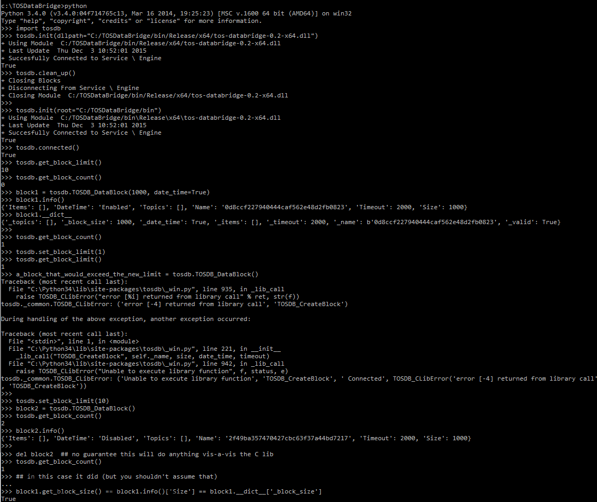
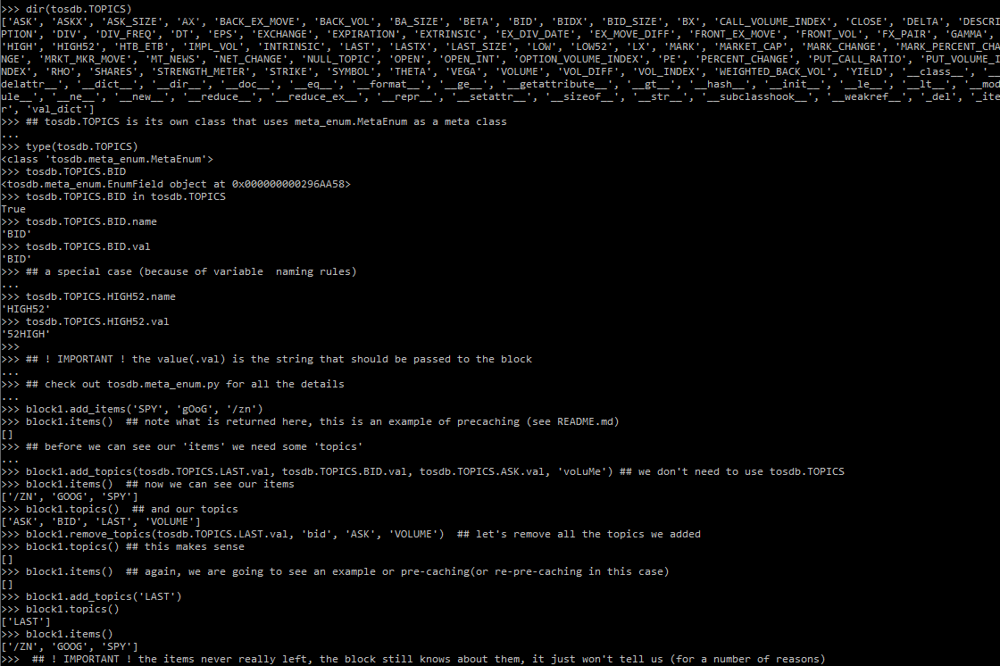
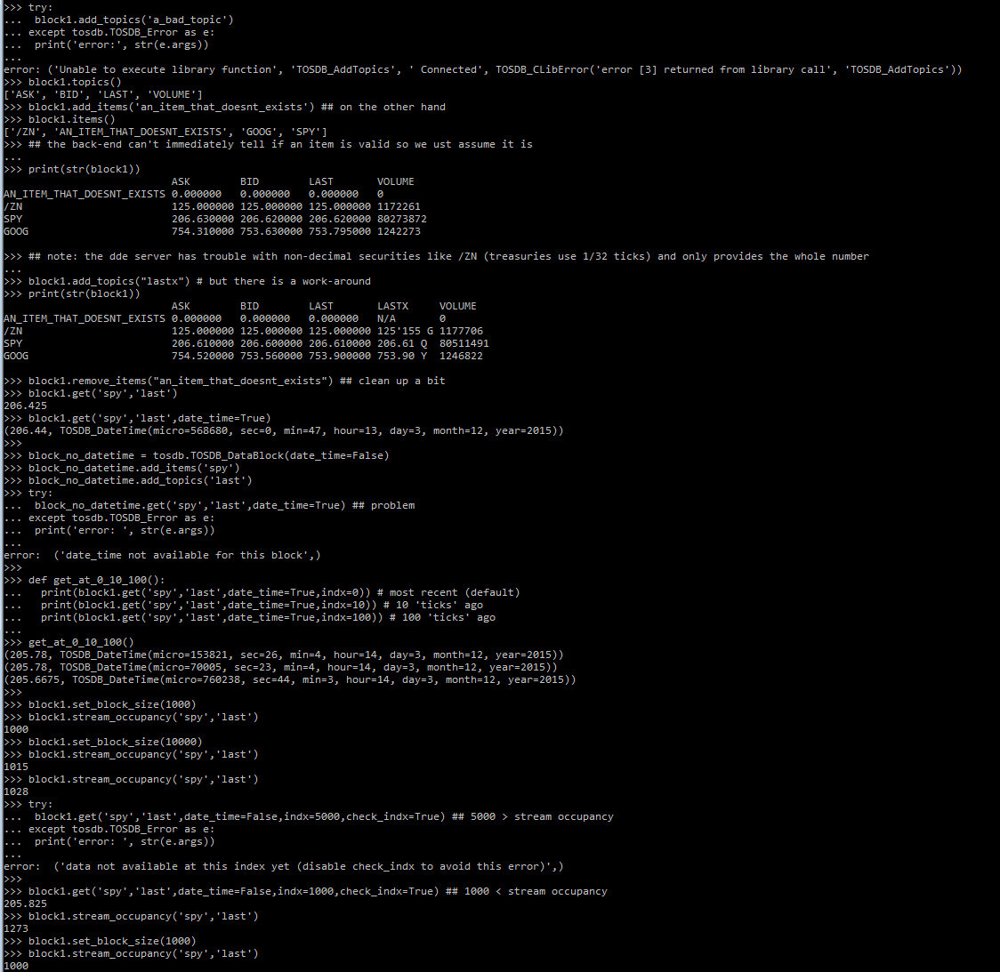
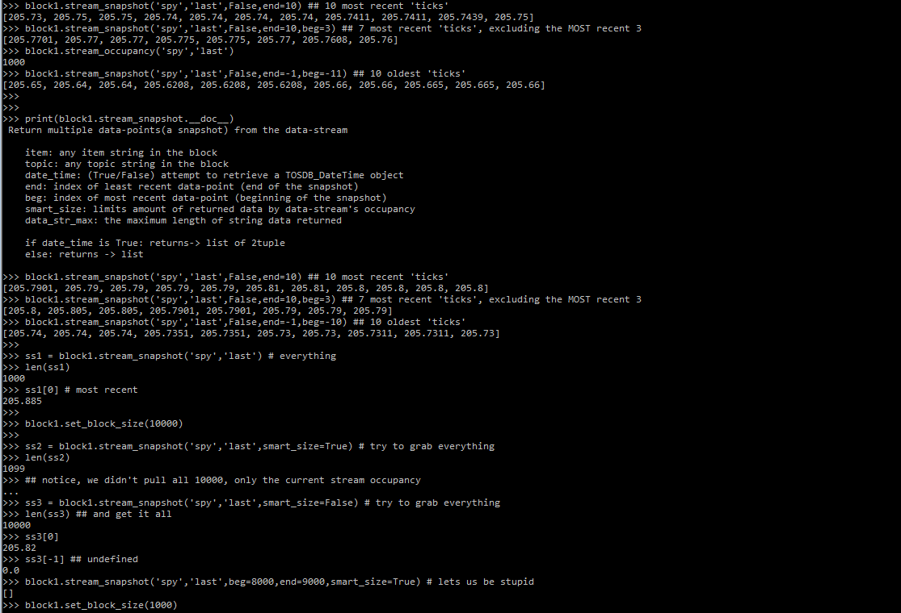

### tosdb/ tutorial 
---

This tutorial attempts to show example usage of the core tosdb package. Please refer to *_win.py*, *_common.py* and *__init__.py* for more details on the core package; *__init__.__doc__* for an explanation of the virtual layer; *__main__.py* for running the package outside of the interactive interpreter; *intervalize.py* for a work-in-progress attempt to build time intervals(e.g OHLC) with the raw data; and *cli_scripts/* for code built on top of the core package.

There are a number of comments inside the screen-shots that help explain what we are doing, and why.

---

- first, cd to the /python directory and run the setup script(if we haven't already)

- import tosdb and experiment with two different ways to initialize
- use some of the global admin calls
- create/delete a TOSDB_DataBlock and examine it's contents
- view our first TOSDB_ exception (see _common.py) 

- show how to use 'items' and 'topics' 
- attempt to illustrate the slightly confusing pre-caching behavior of the block

- show how tosdb handles bad inputs
- start retrieving data from the block
- show how size and occupancy relate to the block's get method

- examine how to retrieve historical data via the block's stream_snapshot method

- examine how we can guarantee contiguous data from different calls via the blocks' stream_snapshot_from_marker method

- examine the different types of 'frame' methods 
- clean up when we're done

