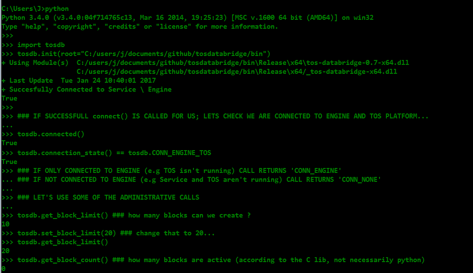
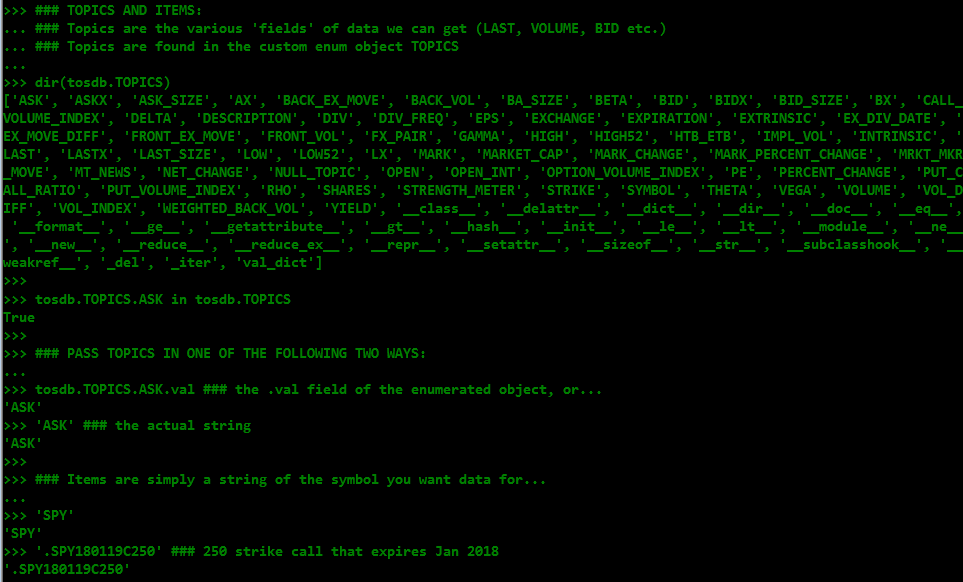
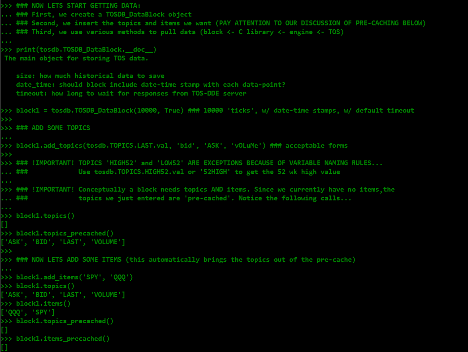
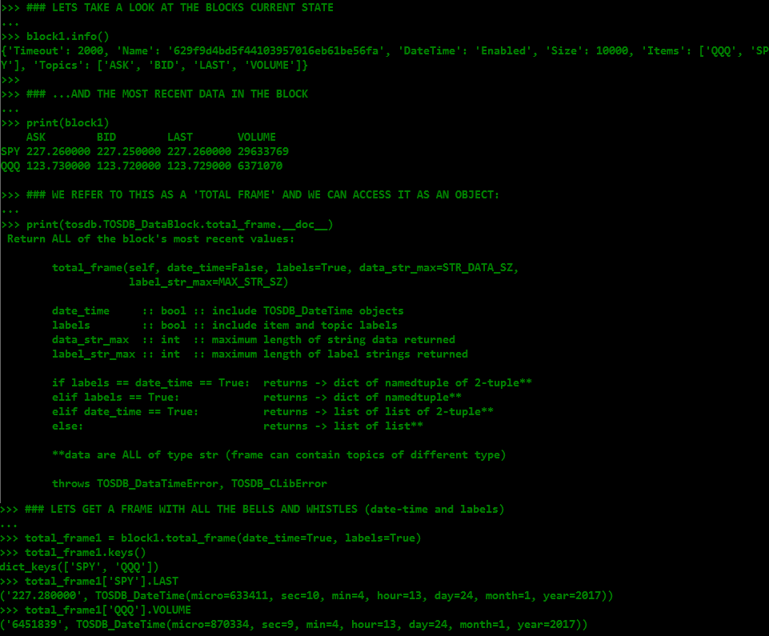
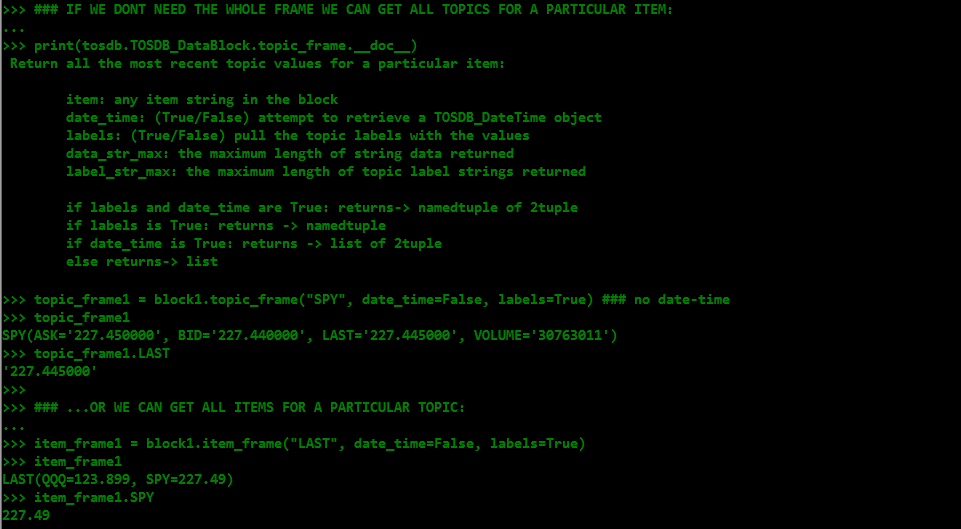
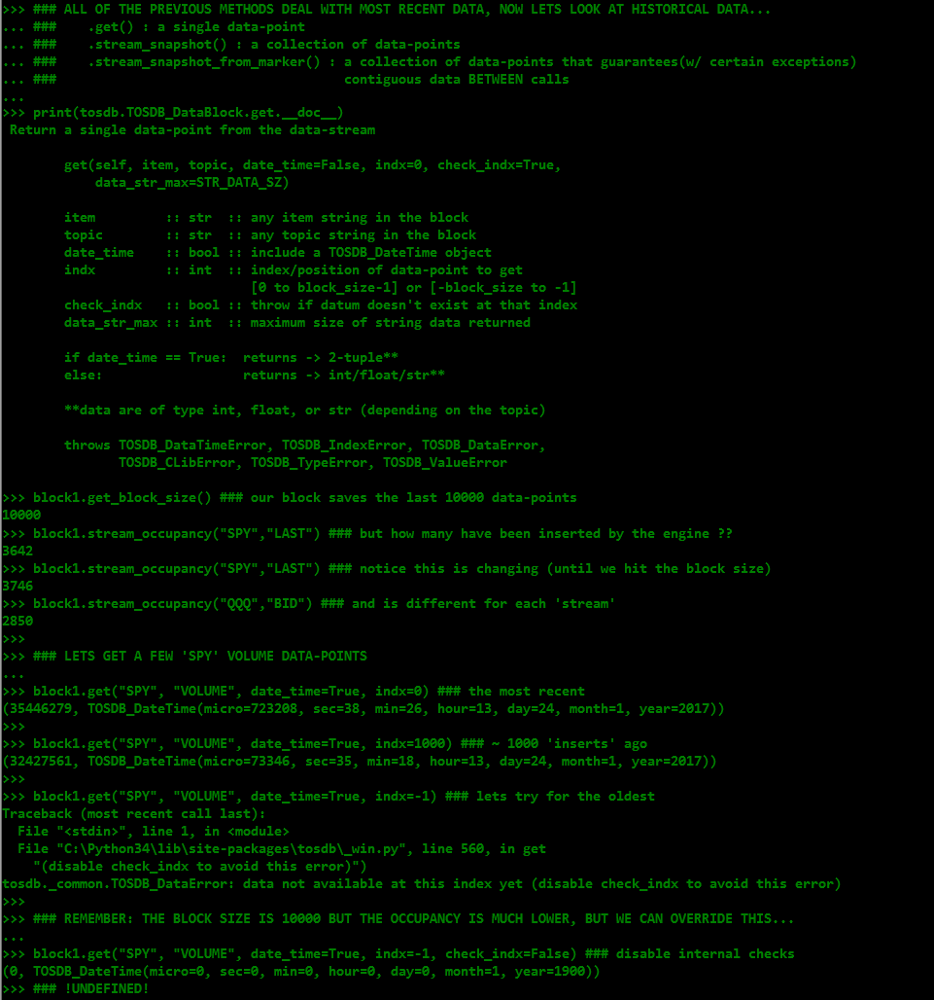
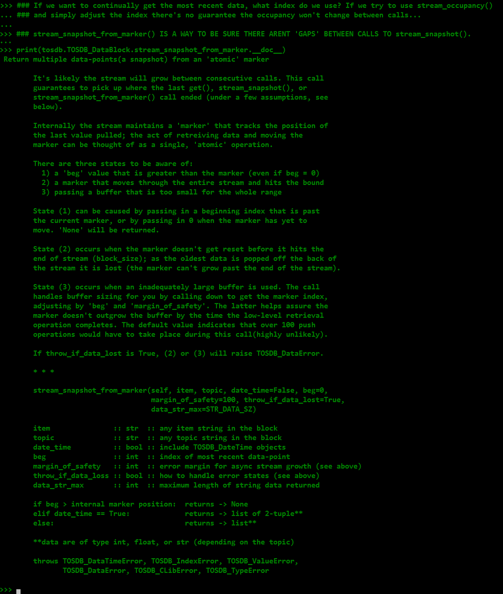
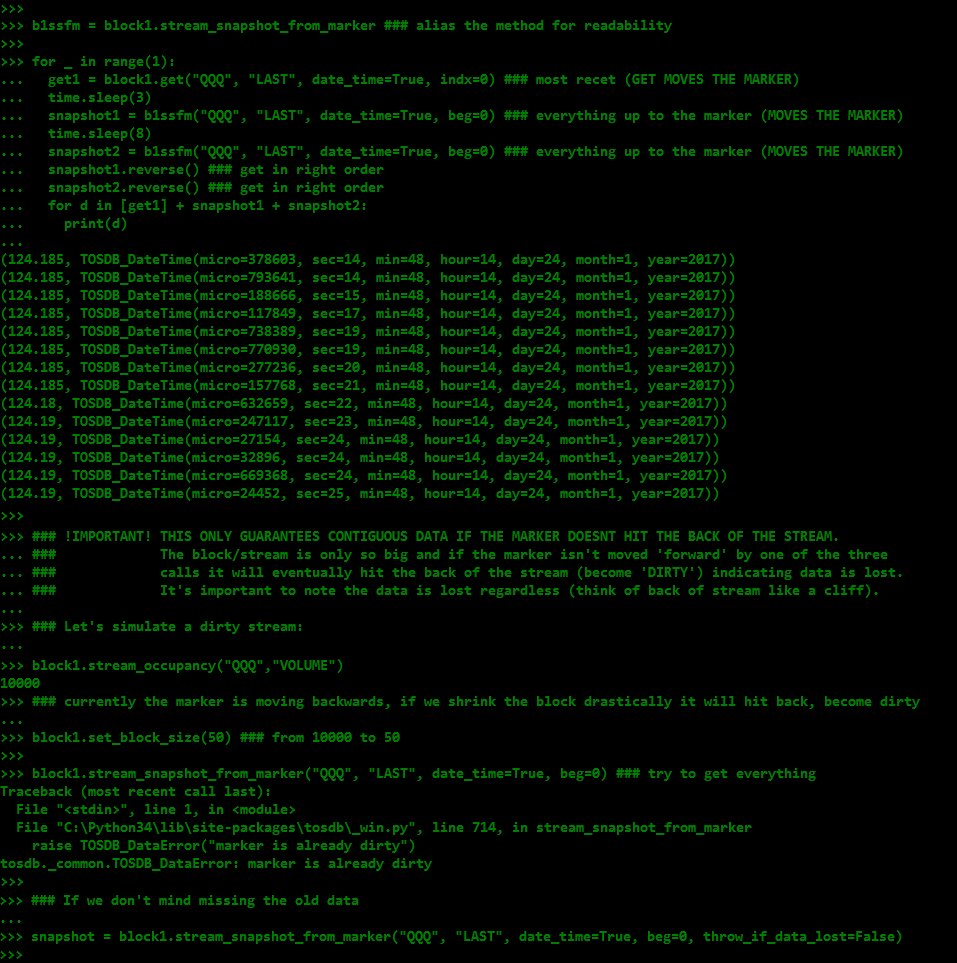
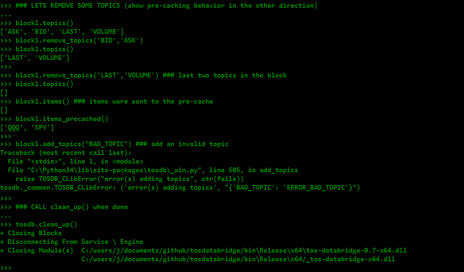

### tosdb/ tutorial 
---

This tutorial attempts to show example usage of the core tosdb package. Please refer to *\_win.py*, *\_common.py* and *\__init__.py* for more details on the core package; *\__init__.\__doc__* for an explanation of the virtual layer; *\__main__.py* for running the package outside of the interactive interpreter; *intervalize/ohlc.py* for fixed-time intervals(e.g OHLC); and *cli_scripts/* for code built on top of the core package.

Comments inside the screen-shots help explain what we are doing and why.

**IMPORTANT:** Before using tosdb/ be sure to:

1. build/install the backend C/C++ modules with the appropriate build(x86 vs. x64) for your version of python, 
2. start the TOSDataBridge Service(SC Start TOSDataBridge),
3. have the TOS platform running, with the correct privileges (i.e if you run as admin you should have passed 'admin' to the tosdb-setup.bat script),
4. install the tosdb/ package (python setup.py install)

---

First, let's initialize the library with the init() call. Be sure to use the correct version of the tos-databridge DLL. If you are using branch/version v0.6, for instance, you should be using tos-databridge-0.6-x86.dll or tos-databridge-0.6-x64.dll.
This loads the shared library into python and tries to automatically connect to the engine.

Next, learn about topics(fields) and items(symbols).

Next, learn about TOSDB_DataBlock, adding items/topics to the block, and pre-caching.

Next, get a 'total frame' from the block.

Or, just get an 'item frame' or a 'topic frame'. Notice that total frames and topic frames return all data as strings because they can contain multiple topics of different types.

Now, let's look at block size, stream occupancy, and the simplest method of pulling a historical data-point from the block.

Next, let's pull multiple contiguous data-points from the block.

Next, let's look at a detailed explanation for how we can pull multiple contiguous data-points using an 'atomic' marker, to avoid missing data between calls.

And, an example:

Finally, lets remove some topics, show a C lib exception with an error code (tos_databridge.h), and **call clean_up() when done**

 

