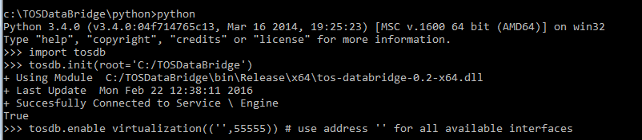
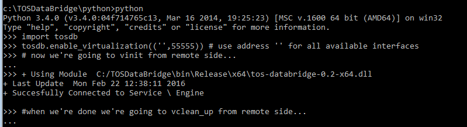
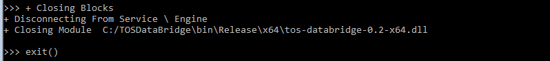

### tosdb virtualization tutorial 
---

This tutorial attempts to show simple example usage of the tosdb virtual layer. Please refer to *\__init__.\__doc__* for an explanation of the virtual layer and the myriad ways to initialize and use it not show in this tutorial.

For this tutorial we are using TOS in a Windows virtual machine. We've set up a host-only network adapter and assigned an address of 192.168.56.101 to this guest machine, and 192.168.56.1 to the host(linux) machine. We've also added a firewall rule allowing TCP IN to port 55555 from our host address. The screen shots are of the 'local'/guest/windows side; the code blocks are of the 'remote'/host/linux side. 

**IMPORTANT:** The virtual layer is **NOT SECURE** and should only be used on internal networks. We haven't implemented any type of connection authentication mechanism and it would be prudent to assume the virtual server could be exploited for remote code execution.

---

#### Local Interactive Init

From an interactive interpreter we are going to initialize tosdb as normal, followed by a call to enable_virtualization with an address tuple indicating what (local address, port) to bind to. 



If sucessfull we can, from the remote machine, create a VTOSDB_DataBlock or use admin_init to access the admin calls. When done we delete the block remotely and use admin_close to close the connections. 


```
jon@jdeb:~/dev/TOSDataBridge$ python3
>>> import tosdb
>>> vblock = tosdb.VTOSDB_DataBlock(('192.168.56.101',55555))
>>> tosdb.admin_init(('192.168.56.101',55555))
>>> tosdb.vconnected()
True
>>> del vblock
>>> tosdb.admin_close()
>>> exit()
```

We can use clean_up locally or vclean_up remotely(before admin_close), if necessary. If we want to stop virtuatlization and keep using the local machine we can call disable_virtualization. 


#### Remote Interactive Init

Similar to the previous approach except we handle all the initialization remotely after we call enable_virtualization locally(as above). 



To initialize we first call admin_init(from the remote machine) in order to access vinit: the remote version of init that takes the sames arguments. (Remember we are passing the 'local' windows path of the underlying library to vinit.)


```
jon@jdeb:~/dev/TOSDataBridge$ python3
>>> import tosdb
>>> tosdb.admin_init(('192.168.56.101',55555))
>>> tosdb.vinit(root="C:/TOSDataBridge")
True
```




Use an admin call, create a block, delete the block, clean up and close the admin interface - all from the remote machine.

```
>>> tosdb.vconnected()
True
>>> vblock = tosdb.VTOSDB_DataBlock(('192.168.56.101',55555))
>>> del vblock
>>> tosdb.vclean_up()
>>> tosdb.admin_close()
>>> exit()
```


#### Local Server Init 

This enables virtualization and handles initialization for you, returning an interactive shell that only accepts a quit command to close. 

\**notice the preceding space in the --virtual-server arg tuple " 55555". This indicates an address of 'all available interfaces'*


From the remote side we can make the necessary calls(as above). 


```
jon@jdeb:~/dev/TOSDataBridge$ python3
>>> import tosdb
>>> vblock = tosdb.VTOSDB_DataBlock(('192.168.56.101',55555))
>>> tosdb.admin_init(('192.168.56.101',55555))
>>> tosdb.vconnected()
True
>>> del vblock
>>> tosdb.admin_close()
>>> exit()
``` 

Or, from the command-line use the --virtual-client switch which will do it for us and drop us into an interactive interpreter.

```
jon@jdeb:~/dev/TOSDataBridge$ python3 python/tosdb --virtual-client "192.168.56.101 55555"
(InteractiveConsole)
>>> vconnected()
True
>>> exit()
```

